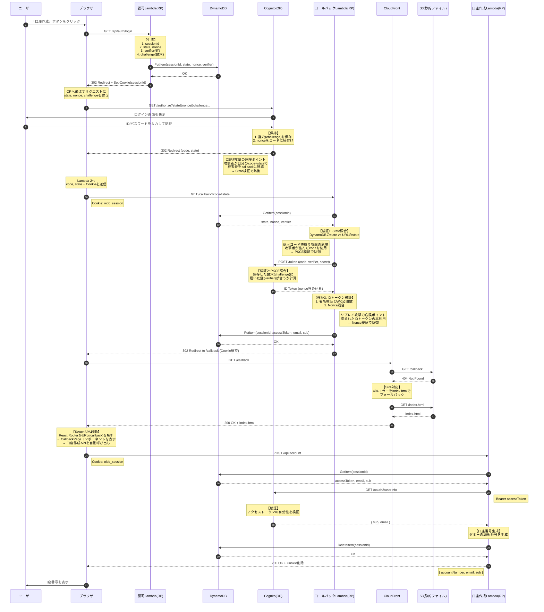
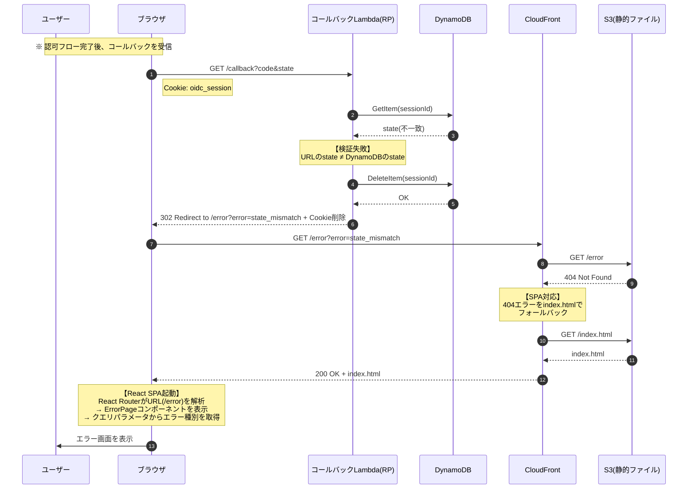
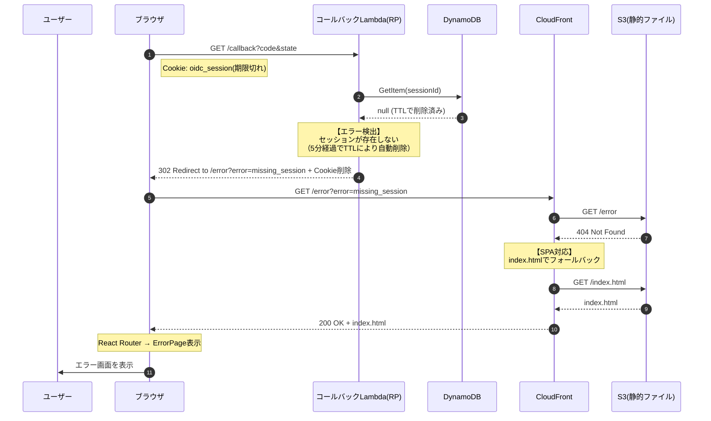
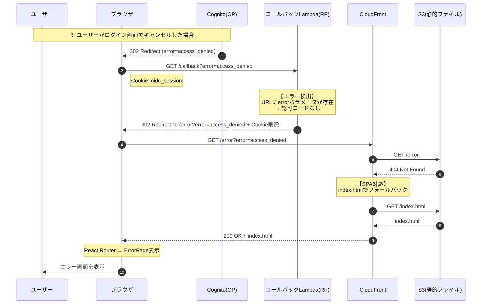
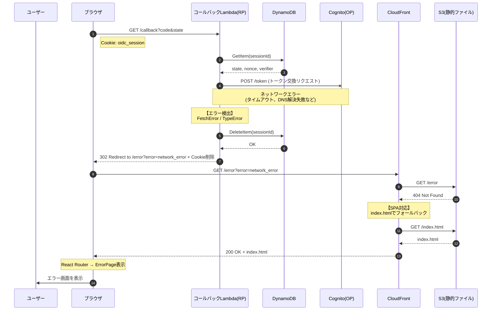
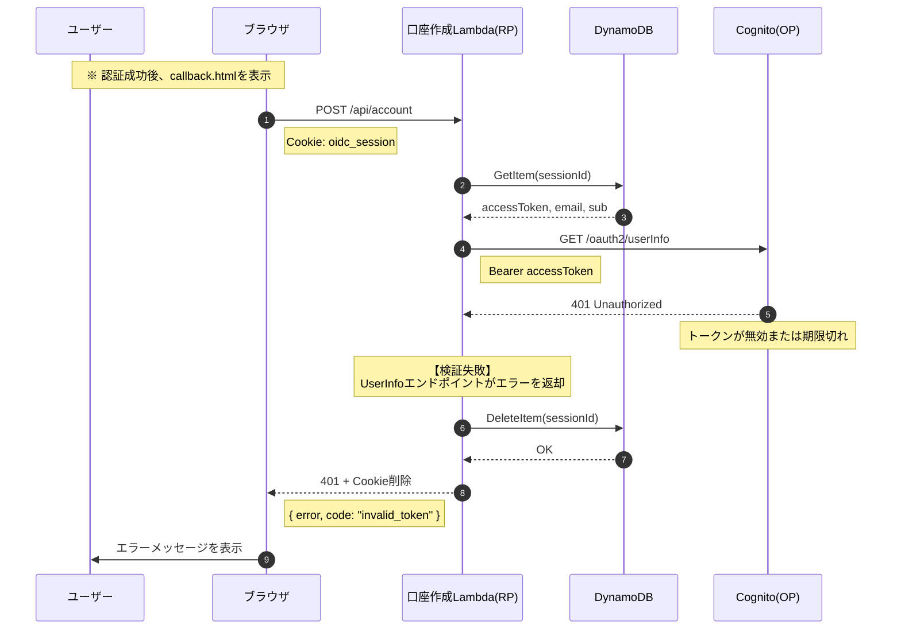
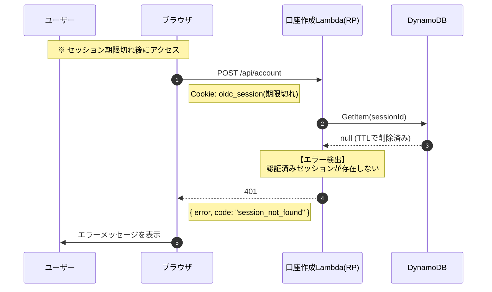
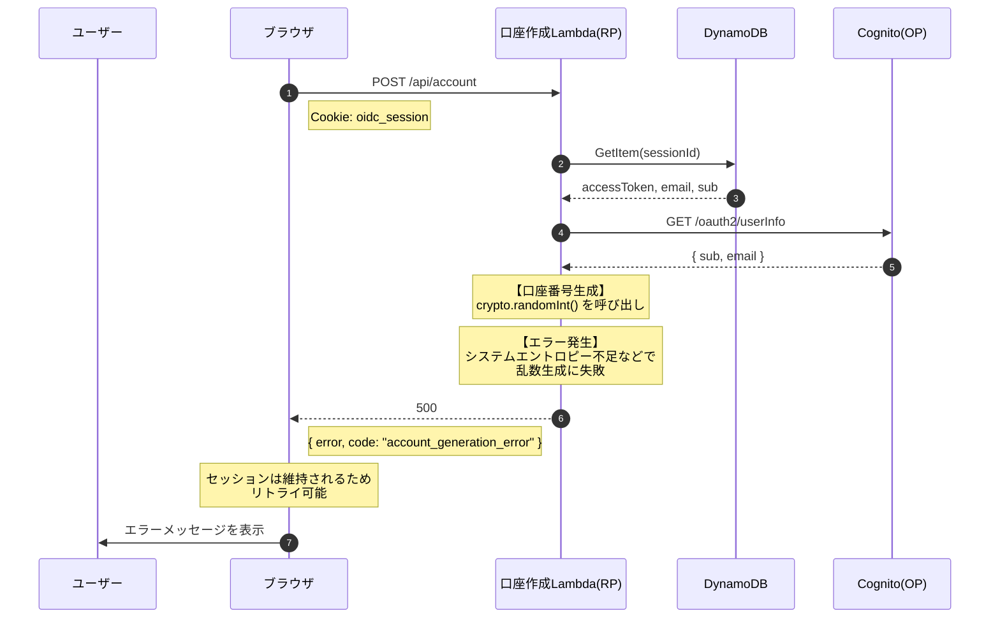

# バックエンド設計書

## 1. 概要

本ドキュメントは、OIDC学習サンドボックスのバックエンド（Lambda関数）の設計を定義します。

### 1.1 バックエンドの役割

バックエンドは **RP（Relying Party）** として機能します。

| 用語                  | 説明             | 今回の実装     |
| --------------------- | ---------------- | -------------- |
| OP（OpenID Provider） | 認証を行う側     | Amazon Cognito |
| RP（Relying Party）   | 認証を依頼する側 | Lambda関数     |

### 1.2 APIエンドポイント一覧

| エンドポイント       | メソッド | 説明                                        |
| -------------------- | -------- | ------------------------------------------- |
| `/api/auth/login`    | GET      | 認可リクエストURLを生成し、リダイレクト     |
| `/api/auth/callback` | GET      | コールバック処理（トークン交換・検証）      |
| `/api/account`       | POST     | 口座作成（アクセストークンで保護されたAPI） |

---

## 2. OIDC認可コードフロー

### 2.1 正常系フロー



### 2.2 異常系フロー（RP側の検証エラー）

State不一致、セッションなしなど、RP（Lambda）側で検出するエラーのフローです。



### 2.3 異常系フロー（セッションなし）

セッションが見つからない（期限切れまたは未設定）場合のフローです。



### 2.4 異常系フロー（OP側のエラー）

認可コード無効、ユーザーによるキャンセルなど、OP（Cognito）側から返されるエラーのフローです。



### 2.5 異常系フロー（ネットワークエラー）

Cognitoへの通信失敗など、ネットワーク起因のエラーのフローです。



### 2.6 異常系フロー（口座作成API - トークン検証失敗）

アクセストークンが無効な場合のフローです。



### 2.7 異常系フロー（口座作成API - セッションなし）

セッションが見つからない場合のフローです。



### 2.8 異常系フロー（口座作成API - 口座番号生成エラー）

口座番号生成に失敗した場合のフローです。



### 2.9 セキュリティパラメータ

| パラメータ                            | 目的                                 | 防ぐ攻撃             | 保存場所 |
| ------------------------------------- | ------------------------------------ | -------------------- | -------- |
| SessionID                             | セッション識別                       | -                    | Cookie   |
| State                                 | 認可リクエストとコールバックの紐付け | CSRF攻撃             | DynamoDB |
| Nonce                                 | IDトークンと認可リクエストの紐付け   | リプレイ攻撃         | DynamoDB |
| PKCE (code_verifier / code_challenge) | 認可コードの正当性証明               | 認可コード横取り攻撃 | DynamoDB |

### 2.10 DynamoDB管理のメリット

| 観点             | Cookie管理         | DynamoDB管理                      |
| ---------------- | ------------------ | --------------------------------- |
| XSS耐性          | △ HttpOnlyで軽減   | ✅ パラメータがブラウザに渡らない |
| セッション無効化 | △ 有効期限まで有効 | ✅ 即座に削除可能                 |
| TTL自動削除      | ❌ ブラウザ依存    | ✅ DynamoDB TTLで自動削除         |
| 実装複雑度       | ✅ シンプル        | △ DynamoDB操作が必要              |

### 2.11 リダイレクト先一覧

| 結果       | リダイレクト先              | 配置場所 |
| ---------- | --------------------------- | -------- |
| 認証成功   | `/callback`                 | S3       |
| 認証エラー | `/error?error=エラーコード` | S3       |

※ 認証成功後、callback.html から口座作成API（`/api/account`）が自動呼び出しされます。

---

## 3. APIエンドポイント詳細

### 3.1 GET /api/auth/login

認可リクエストURLを生成し、Cognitoにリダイレクトします。

#### 処理フロー

1. sessionId を生成（256ビットのランダム文字列）
2. state, nonce, code_verifier を生成（各32バイトのランダム文字列）
3. code_challenge を計算（SHA256 + Base64URL）
4. セッションデータを DynamoDB に保存（TTL: 5分）
5. sessionId を Cookie に保存
6. 認可URLを構築して302リダイレクト

#### レスポンス

```
HTTP/1.1 302 Found
Location: https://xxx.auth.ap-northeast-1.amazoncognito.com/oauth2/authorize
  ?response_type=code
  &client_id=xxx
  &redirect_uri=https://xxx.cloudfront.net/api/auth/callback
  &scope=openid%20email%20profile
  &state=xxx&nonce=xxx&code_challenge=xxx&code_challenge_method=S256
Set-Cookie: oidc_session=xxx; HttpOnly; Secure; SameSite=Lax; Max-Age=300; Path=/
```

### 3.2 GET /api/auth/callback

Cognitoからのコールバックを処理し、トークン交換・検証を行います。

#### 処理フロー

1. URLパラメータから code, state を取得
2. Cookie から sessionId を取得
3. DynamoDB から state, nonce, code_verifier を取得
4. `openid-client` の `authorizationCodeGrant()` を呼び出し（内部で検証を実行）
5. アクセストークンを DynamoDB に保存（セッションIDで紐付け）
6. 検証成功: /callback にリダイレクト（Cookie維持）
7. 検証失敗: /error にリダイレクト

#### エラー一覧

| エラー種別         | 原因                                          | エラーコード        |
| ------------------ | --------------------------------------------- | ------------------- |
| セッションなし     | セッションが見つからない（期限切れ、未設定）  | `missing_session`   |
| state不一致        | CSRF攻撃の可能性                              | `state_mismatch`    |
| nonce不一致        | リプレイ攻撃の可能性                          | `nonce_mismatch`    |
| 認可コードなし     | URLに認可コードが含まれていない               | `missing_code`      |
| ユーザーキャンセル | ユーザーがログイン画面でキャンセル            | `access_denied`     |
| OPエラー           | Cognitoが認可コードを拒否（無効、期限切れ等） | `op_error`          |
| 署名検証失敗       | IDトークンが改ざんされている可能性            | `invalid_signature` |
| 有効期限切れ       | IDトークンの有効期限が過ぎている              | `token_expired`     |
| ネットワークエラー | Cognitoへの通信に失敗                         | `network_error`     |

すべてのエラーは `/error?error=エラーコード` にリダイレクトされます。

### 3.3 POST /api/account

アクセストークンで保護されたAPIの実装例です。
口座番号を生成して返却します。

#### 処理フロー

1. Cookie から sessionId を取得
2. DynamoDB から accessToken, email, sub を取得
3. Cognito UserInfo エンドポイントでトークン検証
4. 口座番号（ダミー10桁）を生成
5. セッションデータを DynamoDB から削除
6. 口座情報を JSON で返却

#### リクエスト

```
POST /api/account
Cookie: oidc_session=xxx
```

#### レスポンス（成功時）

```json
{
  "accountNumber": "1234567890",
  "email": "user@example.com",
  "sub": "xxxxxxxx-xxxx-xxxx-xxxx-xxxxxxxxxxxx"
}
```

#### エラー一覧

| HTTPステータス | エラーコード               | 原因                                       |
| -------------- | -------------------------- | ------------------------------------------ |
| 401            | `missing_session`          | セッションIDがCookieに存在しない           |
| 401            | `session_not_found`        | セッションがDynamoDBに存在しない           |
| 401            | `invalid_token`            | アクセストークンが無効（UserInfo検証失敗） |
| 500            | `session_error`            | DynamoDB操作エラー                         |
| 500            | `account_generation_error` | 口座番号生成エラー（エントロピー不足など） |

#### セキュリティポイント

- アクセストークンはブラウザに渡らない（DynamoDBで管理）
- UserInfoエンドポイントでトークンの有効性を検証
- 処理完了後にセッションを即座に削除（再利用防止）

---

## 4. 実装詳細

### 4.1 ディレクトリ構成

```
backend/
├── src/
│   ├── handlers/
│   │   ├── login.ts              # /api/auth/login ハンドラー
│   │   ├── callback.ts           # /api/auth/callback ハンドラー
│   │   └── account.ts            # /api/account ハンドラー
│   ├── utils/
│   │   ├── cookie.ts             # Cookie操作ユーティリティ（未使用）
│   │   ├── oidc-config.ts        # OIDC Discovery ユーティリティ
│   │   ├── pkce.ts               # PKCE生成ユーティリティ
│   │   ├── secrets.ts            # Secrets Manager ユーティリティ
│   │   ├── session.ts            # セッション管理ユーティリティ（DynamoDB）
│   │   └── ssm.ts                # SSM Parameter Store ユーティリティ
│   └── types/
│       └── index.ts              # 型定義
├── package.json
└── tsconfig.json
```

### 4.2 OIDC Discovery

OIDC Discovery は、OP（OpenID Provider）のメタデータを自動取得する仕組みです。
Issuer URL から `/.well-known/openid-configuration` にアクセスすることで、各種エンドポイントを動的に取得できます。

**Discovery レスポンス例:**

```json
{
  "issuer": "https://cognito-idp.ap-northeast-1.amazonaws.com/{userPoolId}",
  "authorization_endpoint": "https://xxx.auth.ap-northeast-1.amazoncognito.com/oauth2/authorize",
  "token_endpoint": "https://xxx.auth.ap-northeast-1.amazoncognito.com/oauth2/token",
  "userinfo_endpoint": "https://xxx.auth.ap-northeast-1.amazoncognito.com/oauth2/userInfo",
  "jwks_uri": "https://cognito-idp.ap-northeast-1.amazonaws.com/{userPoolId}/.well-known/jwks.json"
}
```

**メリット:**

- OP のエンドポイント URL をハードコードする必要がない
- Cognito、Auth0、Keycloak など、異なる OP に対応可能
- OP 側の設定変更（エンドポイント変更等）に自動追従

**本プロジェクトでの使用:**

- `login.ts`: `authorization_endpoint` を取得
- `callback.ts`: `token_endpoint`, `jwks_uri` を取得（openid-client 内部で使用）
- `account.ts`: `userinfo_endpoint` を取得

### 4.3 使用ライブラリ

| ライブラリ                       | 用途                                                |
| -------------------------------- | --------------------------------------------------- |
| openid-client                    | OIDC認証フロー全体（Discovery、トークン交換、検証） |
| @aws-sdk/client-dynamodb         | DynamoDBへのセッションデータ保存・取得・削除        |
| @aws-sdk/client-secrets-manager  | Secrets Managerからシークレット取得                 |
| @aws-sdk/client-ssm              | SSM Parameter StoreからCloudFront URL取得           |

#### ライブラリ選定理由

| 比較項目     | openid-client                 | jose + 手動実装           |
| ------------ | ----------------------------- | ------------------------- |
| 実装の手軽さ | ✅ 簡単                       | ❌ 手間がかかる           |
| セキュリティ | ✅ ベストプラクティス組み込み | △ 自分で注意が必要        |
| 学習効果     | △ 内部が隠蔽される            | ✅ 各ステップを理解できる |

今回は `openid-client` を採用し、ブラックボックス化される処理はコメントで解説します。

### 4.4 セッション管理（session.ts）

```typescript
import * as crypto from 'crypto'
import {
  DynamoDBClient,
  PutItemCommand,
  GetItemCommand,
  DeleteItemCommand
} from '@aws-sdk/client-dynamodb'

export interface SessionData {
  state: string
  nonce: string
  codeVerifier: string
}

const dynamoClient = new DynamoDBClient({})
const SESSION_TTL_SECONDS = 300 // 5分

/**
 * セッションIDを生成
 * 256ビットのランダム文字列（Base64URL）
 */
export function generateSessionId(): string {
  return crypto.randomBytes(32).toString('base64url')
}

/**
 * セッションをDynamoDBに保存
 */
export async function saveSession(sessionId: string, data: SessionData): Promise<void> {
  const ttl = Math.floor(Date.now() / 1000) + SESSION_TTL_SECONDS

  await dynamoClient.send(
    new PutItemCommand({
      TableName: process.env.SESSION_TABLE_NAME,
      Item: {
        sessionId: { S: sessionId },
        state: { S: data.state },
        nonce: { S: data.nonce },
        codeVerifier: { S: data.codeVerifier },
        ttl: { N: ttl.toString() }
      }
    })
  )
}

/**
 * セッションをDynamoDBから取得
 */
export async function getSession(sessionId: string): Promise<SessionData | null> {
  const result = await dynamoClient.send(
    new GetItemCommand({
      TableName: process.env.SESSION_TABLE_NAME,
      Key: { sessionId: { S: sessionId } }
    })
  )

  if (!result.Item) return null

  return {
    state: result.Item.state?.S || '',
    nonce: result.Item.nonce?.S || '',
    codeVerifier: result.Item.codeVerifier?.S || ''
  }
}

/**
 * セッションをDynamoDBから削除
 */
export async function deleteSession(sessionId: string): Promise<void> {
  await dynamoClient.send(
    new DeleteItemCommand({
      TableName: process.env.SESSION_TABLE_NAME,
      Key: { sessionId: { S: sessionId } }
    })
  )
}
```

### 4.5 環境変数

| 変数名                   | 説明                                                  |
| ------------------------ | ----------------------------------------------------- |
| OIDC_ISSUER              | OIDC Issuer URL（OIDC Discovery のベース URL）       |
| OIDC_CLIENT_ID_KEY       | Client ID を保存した Secrets Manager のシークレット名 |
| OIDC_CLIENT_SECRET_KEY   | Client Secret を保存した Secrets Manager のシークレット名 |
| SSM_CLOUDFRONT_URL_PARAM | SSMパラメータ名（CloudFront URL取得用）               |
| SESSION_TABLE_NAME       | DynamoDBテーブル名                                    |

**シークレットの取得方法:**

循環参照を避けるため、Client ID と Client Secret は環境変数ではなく Secrets Manager から実行時に取得します。
`secrets.ts` の `getClientId()` / `getClientSecret()` 関数が Secrets Manager API で値を取得し、Lambda のウォームスタート時にキャッシュします。

**REDIRECT_URIの取得方法:**

循環参照を避けるため、REDIRECT_URIは環境変数ではなくSSM Parameter Storeから実行時に取得します。
`ssm.ts`の`getRedirectUri()`関数がSSMからCloudFront URLを取得し、`/api/auth/callback`を付加してREDIRECT_URIを構築します。

**OIDC_ISSUER の例:**

- Cognito: `https://cognito-idp.ap-northeast-1.amazonaws.com/{userPoolId}`
- Auth0: `https://{tenant}.auth0.com`
- Keycloak: `https://{host}/realms/{realm}`

### 4.6 DynamoDBテーブル設計

セッションテーブルは2種類のデータを保存します。

#### 認可フロー中のセッション

| 属性名       | 型          | 説明                               |
| ------------ | ----------- | ---------------------------------- |
| sessionId    | String (PK) | セッションID（パーティションキー） |
| state        | String      | CSRF対策用パラメータ               |
| nonce        | String      | リプレイ攻撃対策用パラメータ       |
| codeVerifier | String      | PKCE用パラメータ                   |
| ttl          | Number      | TTL（UNIXタイムスタンプ）          |

#### 認証済みセッション

| 属性名        | 型          | 説明                                   |
| ------------- | ----------- | -------------------------------------- |
| sessionId     | String (PK) | セッションID（パーティションキー）     |
| accessToken   | String      | アクセストークン（UserInfo呼び出し用） |
| email         | String      | ユーザーのメールアドレス               |
| sub           | String      | ユーザーの一意識別子                   |
| authenticated | Boolean     | 認証済みフラグ（true）                 |
| ttl           | Number      | TTL（UNIXタイムスタンプ）              |

- **TTL**: 5分（300秒）
- **課金モード**: オンデマンド（PAY_PER_REQUEST）
- **備考**: 認可フロー完了時に認可フロー用データを認証済みデータで上書き

### 4.7 実装時の注意事項

#### 4.7.1 リダイレクトURLの不一致

OPに登録したURLと、コードで指定する `redirect_uri` は **完全一致** が必要です。

| NG例                                                              | 理由                 |
| ----------------------------------------------------------------- | -------------------- |
| `https://example.com/callback` vs `https://example.com/callback/` | 末尾スラッシュの有無 |
| `https://example.com/callback` vs `https://Example.com/callback`  | 大文字小文字の違い   |
| `http://...` vs `https://...`                                     | スキームの違い       |

**対策**: CDKで生成したCloudFrontのURLを環境変数として渡し、Cognito App Client の設定と Lambda の両方で同じ値を参照するようにします。

#### 4.7.2 Clock Skew（時計のズレ）

サーバー間の時刻が数秒ズレているだけで、IDトークン検証時に以下のエラーが発生する可能性があります。

- `"Token is not yet valid (nbf)"` - トークンがまだ有効化されていない
- `"Token has expired (exp)"` - トークンの有効期限切れ（実際は有効）

**対策**: `openid-client` の `clockTolerance` オプションで数秒の猶予を設定します。

#### 4.7.3 JWKのキャッシュ

IDトークンの署名検証には、OPから公開鍵（JWK）を取得する必要があります。検証のたびにOPへ取得しに行くと、レイテンシが増加します。

**openid-clientの動作**: `openid-client` はデフォルトでJWKをキャッシュするため、通常は追加設定不要です。ただし、Lambda のコールドスタート時には初回取得が発生します。

**補足**: 本番環境で頻繁なコールドスタートが問題になる場合は、Provisioned Concurrency の使用を検討してください。

#### 4.7.4 DynamoDBのTTL

DynamoDBのTTLは即座に削除されるわけではありません（最大48時間のラグ）。ただし、認証完了後に明示的に `DeleteItem` を呼び出すため、通常はセッションデータは即座に無効化されます。

---

## 5. セキュリティ考慮事項

### 5.1 実装するセキュリティ対策

| 対策                                 | 実装方法                         |
| ------------------------------------ | -------------------------------- |
| State / Nonce / PKCE / 署名検証      | `openid-client` が自動実行       |
| HttpOnly / Secure / SameSite Cookie  | 手動実装（セッションID用Cookie） |
| セッションデータのサーバーサイド管理 | DynamoDB                         |
| セッションの即座無効化               | 認証完了後にDeleteItem           |
| セッションの自動削除                 | DynamoDB TTL（5分）              |

### 5.2 学習用途のため簡略化した項目

| 項目                     | 本番環境での推奨       | 今回の対応                  |
| ------------------------ | ---------------------- | --------------------------- |
| クライアントシークレット | Secrets Manager で管理 | ✅ Secrets Manager で管理   |
| Rate Limiting            | CloudFront/WAFで制限   | なし                        |
| WAF                      | 有効化                 | なし                        |
