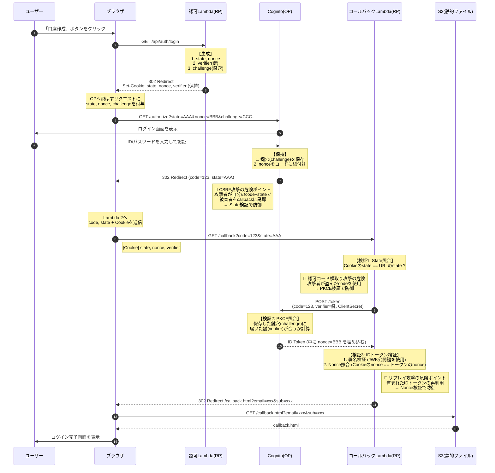
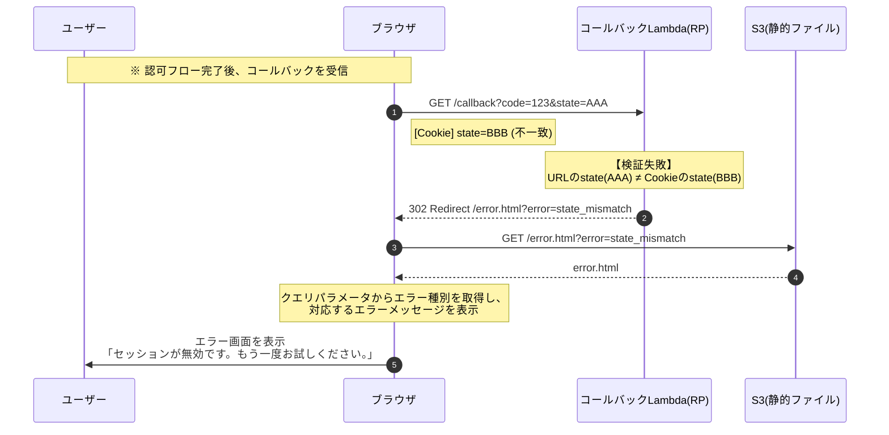
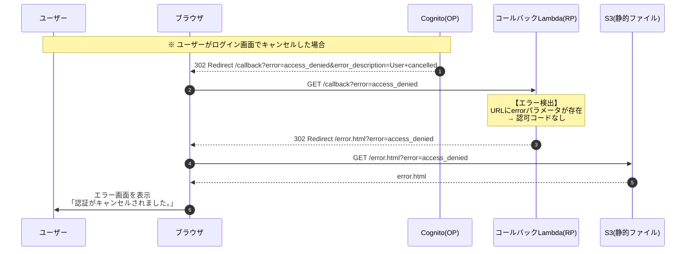
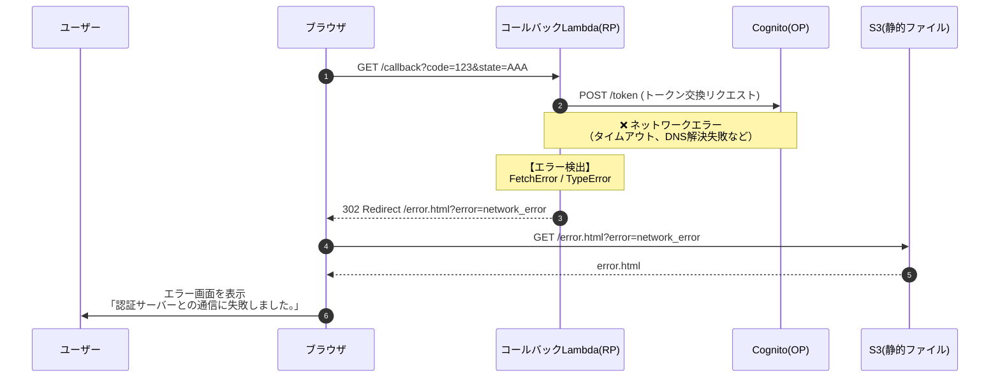

# バックエンド設計書

## 1. 概要

本ドキュメントは、OIDC学習サンドボックスのバックエンド（Lambda関数）の設計を定義します。

### 1.1 バックエンドの役割

バックエンドは **RP（Relying Party）** として機能します。

| 用語 | 説明 | 今回の実装 |
|------|------|------------|
| OP（OpenID Provider） | 認証を行う側 | Amazon Cognito |
| RP（Relying Party） | 認証を依頼する側 | Lambda関数 |

### 1.2 APIエンドポイント一覧

| エンドポイント | メソッド | 説明 |
|---------------|----------|------|
| `/api/auth/login` | GET | 認可リクエストURLを生成し、リダイレクト |
| `/api/auth/callback` | GET | コールバック処理（トークン交換・検証） |

---

## 2. OIDC認可コードフロー

### 2.1 正常系フロー



### 2.2 異常系フロー（RP側の検証エラー）

State不一致、Nonce不一致、Cookieなしなど、RP（Lambda）側で検出するエラーのフローです。



### 2.3 異常系フロー（OP側のエラー）

認可コード無効、ユーザーによるキャンセルなど、OP（Cognito）側から返されるエラーのフローです。



### 2.4 異常系フロー（ネットワークエラー）

Cognitoへの通信失敗など、ネットワーク起因のエラーのフローです。



### 2.5 セキュリティパラメータ

| パラメータ | 目的 | 防ぐ攻撃 |
|-----------|------|---------|
| State | 認可リクエストとコールバックの紐付け | CSRF攻撃 |
| Nonce | IDトークンと認可リクエストの紐付け | リプレイ攻撃 |
| PKCE (code_verifier / code_challenge) | 認可コードの正当性証明 | 認可コード横取り攻撃 |

### 2.6 リダイレクト先一覧

| 結果 | リダイレクト先 | 配置場所 |
|------|---------------|---------|
| 成功 | `/callback.html?email=xxx&sub=xxx` | S3 |
| エラー | `/error.html?error=エラーコード` | S3 |

---

## 3. APIエンドポイント詳細

### 3.1 GET /api/auth/login

認可リクエストURLを生成し、Cognitoにリダイレクトします。

#### 処理フロー

1. state, nonce, code_verifier を生成（各32バイトのランダム文字列）
2. code_challenge を計算（SHA256 + Base64URL）
3. 生成した値を Cookie に保存
4. 認可URLを構築して302リダイレクト

#### レスポンス

```
HTTP/1.1 302 Found
Location: https://xxx.auth.ap-northeast-1.amazoncognito.com/oauth2/authorize
  ?response_type=code
  &client_id=xxx
  &redirect_uri=https://xxx.cloudfront.net/api/auth/callback
  &scope=openid%20email%20profile
  &state=xxx&nonce=xxx&code_challenge=xxx&code_challenge_method=S256
Set-Cookie: oidc_state=xxx; HttpOnly; Secure; SameSite=Lax; Max-Age=600
Set-Cookie: oidc_nonce=xxx; HttpOnly; Secure; SameSite=Lax; Max-Age=600
Set-Cookie: oidc_code_verifier=xxx; HttpOnly; Secure; SameSite=Lax; Max-Age=600
```

### 3.2 GET /api/auth/callback

Cognitoからのコールバックを処理し、トークン交換・検証を行います。

#### 処理フロー

1. URLパラメータから code, state を取得
2. Cookieから state, nonce, code_verifier を取得
3. `openid-client` の `client.callback()` を呼び出し（内部で検証を実行）
4. 検証成功: 成功ページにリダイレクト
5. 検証失敗: エラーページにリダイレクト

#### エラー一覧

| エラー種別 | 原因 | エラーコード |
|-----------|------|-------------|
| state不一致 | CSRF攻撃の可能性、またはCookieが期限切れ | `state_mismatch` |
| nonce不一致 | リプレイ攻撃の可能性 | `nonce_mismatch` |
| 認可コードなし | URLに認可コードが含まれていない | `missing_code` |
| ユーザーキャンセル | ユーザーがログイン画面でキャンセル | `access_denied` |
| OPエラー | Cognitoが認可コードを拒否（無効、期限切れ等） | `op_error` |
| 署名検証失敗 | IDトークンが改ざんされている可能性 | `invalid_signature` |
| 有効期限切れ | IDトークンの有効期限が過ぎている | `token_expired` |
| ネットワークエラー | Cognitoへの通信に失敗 | `network_error` |

すべてのエラーは `/error.html?error=エラーコード` にリダイレクトされます。

---

## 4. 実装詳細

### 4.1 ディレクトリ構成

```
backend/
├── src/
│   ├── handlers/
│   │   ├── login.ts              # /api/auth/login ハンドラー
│   │   └── callback.ts           # /api/auth/callback ハンドラー
│   ├── utils/
│   │   └── cookie.ts             # Cookie操作ユーティリティ
│   └── types/
│       └── index.ts              # 型定義
├── package.json
└── tsconfig.json
```

### 4.2 使用ライブラリ

| ライブラリ | 用途 |
|-----------|------|
| openid-client | OIDC認証フロー全体（Discovery、トークン交換、検証） |

#### ライブラリ選定理由

| 比較項目 | openid-client | jose + 手動実装 |
|----------|---------------|-----------------|
| 実装の手軽さ | ✅ 簡単 | ❌ 手間がかかる |
| セキュリティ | ✅ ベストプラクティス組み込み | △ 自分で注意が必要 |
| 学習効果 | △ 内部が隠蔽される | ✅ 各ステップを理解できる |

今回は `openid-client` を採用し、ブラックボックス化される処理はコメントで解説します。

### 4.3 実装例（コールバックハンドラー）

```typescript
import { APIGatewayProxyHandler } from 'aws-lambda';
import { Issuer } from 'openid-client';

export const handler: APIGatewayProxyHandler = async (event) => {
  // 1. Cognito(OP)の情報を自動取得（OIDC Discovery）
  // ISSUER_URLにアクセスし、トークンエンドポイントやJWKSの場所を自動取得
  const issuer = await Issuer.discover(process.env.ISSUER_URL!);
  
  const client = new issuer.Client({
    client_id: process.env.CLIENT_ID!,
    client_secret: process.env.CLIENT_SECRET!,
    redirect_uris: [process.env.REDIRECT_URI!],
  });

  // 2. ブラウザから届いた情報を整理
  const params = client.callbackParams(event); 
  const cookies = parseCookies(event.headers.Cookie);

  // 2.1 OPからのエラーレスポンスをチェック（ユーザーキャンセル等）
  if (params.error) {
    return redirectToError(params.error as string);
  }

  // 3. 検証用の「正解データ」をセット
  const checks = {
    state: cookies.oidc_state,           // CSRF対策
    nonce: cookies.oidc_nonce,           // リプレイ攻撃対策
    code_verifier: cookies.oidc_code_verifier // PKCE対策
  };

  try {
    // 4. client.callback() で5つの検証が自動実行される
    // ① State照合 ② トークン交換 ③ JWK署名検証 ④ Nonce照合 ⑤ 有効期限チェック
    const tokenSet = await client.callback(
      process.env.REDIRECT_URI, 
      params, 
      checks,
      { clockTolerance: 5 }  // サーバー間の時刻ズレを5秒まで許容
    );

    const claims = tokenSet.claims();
    
    // 成功: callback.html にリダイレクト
    return {
      statusCode: 302,
      headers: {
        Location: `/callback.html?email=${encodeURIComponent(claims.email || '')}&sub=${claims.sub}`,
        'Set-Cookie': 'oidc_state=; Max-Age=0, oidc_nonce=; Max-Age=0, oidc_code_verifier=; Max-Age=0',
      },
      body: '',
    };

  } catch (err) {
    // エラーの種類に応じてリダイレクト先を決定
    // - OPError: Cognitoからのエラー（認可コード無効など）
    // - RPError: RP側の検証エラー（state不一致など）
    // - TypeError/FetchError: ネットワークエラー
    console.error('認証エラー:', err);
    
    const errorCode = getErrorCode(err);
    return redirectToError(errorCode);
  }
};

/**
 * エラーページへのリダイレクトレスポンスを生成
 */
function redirectToError(errorCode: string) {
  return { 
    statusCode: 302,
    headers: { 
      Location: `/error.html?error=${errorCode}`,
      'Set-Cookie': 'oidc_state=; Max-Age=0, oidc_nonce=; Max-Age=0, oidc_code_verifier=; Max-Age=0',
    },
    body: '',
  };
}

/**
 * エラーの種類からエラーコードを判定
 */
function getErrorCode(err: unknown): string {
  if (err instanceof Error) {
    if (err.message.includes('state')) return 'state_mismatch';
    if (err.message.includes('nonce')) return 'nonce_mismatch';
    if (err.name === 'OPError') return 'op_error';
    if (err.name === 'TypeError' || err.name === 'FetchError') return 'network_error';
  }
  return 'authentication_failed';
}

function parseCookies(header?: string): Record<string, string> {
  const list: Record<string, string> = {};
  if (!header) return list;
  header.split(';').forEach(cookie => {
    const [name, ...rest] = cookie.split('=');
    list[name.trim()] = decodeURIComponent(rest.join('='));
  });
  return list;
}
```

### 4.4 環境変数

| 変数名 | 説明 |
|--------|------|
| ISSUER_URL | OIDC Issuer URL（例: `https://cognito-idp.ap-northeast-1.amazonaws.com/ap-northeast-1_XXXXX`） |
| CLIENT_ID | OIDCクライアントID |
| CLIENT_SECRET | OIDCクライアントシークレット |
| REDIRECT_URI | 認証後のリダイレクトURI |
| FRONTEND_URL | フロントエンドのURL |

### 4.5 実装時の注意事項

#### 4.5.1 リダイレクトURLの不一致

OPに登録したURLと、コードで指定する `redirect_uri` は **完全一致** が必要です。

| NG例 | 理由 |
|------|------|
| `https://example.com/callback` vs `https://example.com/callback/` | 末尾スラッシュの有無 |
| `https://example.com/callback` vs `https://Example.com/callback` | 大文字小文字の違い |
| `http://...` vs `https://...` | スキームの違い |

**対策**: CDKで生成したCloudFrontのURLを環境変数として渡し、Cognito App Client の設定と Lambda の両方で同じ値を参照するようにします。

#### 4.5.2 Clock Skew（時計のズレ）

サーバー間の時刻が数秒ズレているだけで、IDトークン検証時に以下のエラーが発生する可能性があります。

- `"Token is not yet valid (nbf)"` - トークンがまだ有効化されていない
- `"Token has expired (exp)"` - トークンの有効期限切れ（実際は有効）

**対策**: `openid-client` の `clockTolerance` オプションで数秒の猶予を設定します。

```typescript
const tokenSet = await client.callback(
  process.env.REDIRECT_URI, 
  params, 
  checks,
  { clockTolerance: 5 }  // 5秒の許容範囲を設定
);
```

#### 4.5.3 JWKのキャッシュ

IDトークンの署名検証には、OPから公開鍵（JWK）を取得する必要があります。検証のたびにOPへ取得しに行くと、レイテンシが増加します。

**openid-clientの動作**: `openid-client` はデフォルトでJWKをキャッシュするため、通常は追加設定不要です。ただし、Lambda のコールドスタート時には初回取得が発生します。

**補足**: 本番環境で頻繁なコールドスタートが問題になる場合は、Provisioned Concurrency の使用を検討してください。

---

## 5. セキュリティ考慮事項

### 5.1 実装するセキュリティ対策

| 対策 | 実装方法 |
|------|---------|
| State / Nonce / PKCE / 署名検証 | `openid-client` が自動実行 |
| HttpOnly / Secure / SameSite Cookie | 手動実装（Cookie設定時） |

### 5.2 学習用途のため簡略化した項目

| 項目 | 本番環境での推奨 | 今回の対応 |
|------|------------------|------------|
| クライアントシークレット | Secrets Manager で管理 | 環境変数で保持 |
| Rate Limiting | API Gatewayで制限 | なし |
| WAF | 有効化 | なし |
