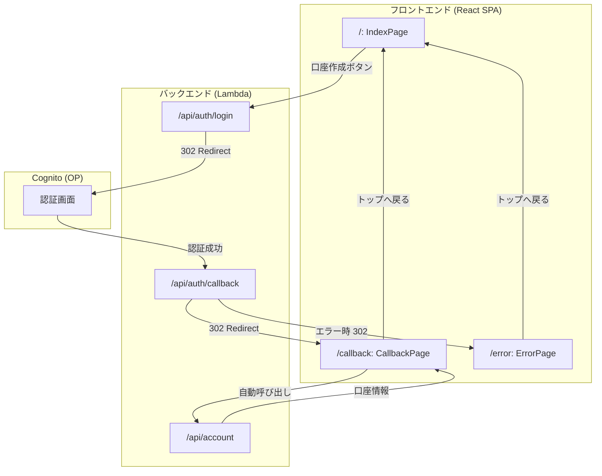

# フロントエンド設計書

## 1. 概要

本ドキュメントは、OIDC学習サンドボックスのフロントエンド（React SPA）の設計を定義します。

### 1.1 フロントエンドの役割

- ユーザーに認証フローの開始点（「口座作成」ボタン）を提供する
- 認証結果（成功・エラー）を画面に表示する

### 1.2 技術スタック

| 項目 | 選定 |
|------|------|
| 言語 | TypeScript |
| フレームワーク | React 18 |
| ルーティング | React Router v7 |
| スタイル | Tailwind CSS |
| ビルドツール | Vite |
| 状態管理 | React Context |
| 配置先 | S3 + CloudFront |

---

## 2. 画面一覧

| 画面 | コンポーネント | URL | 説明 |
|------|---------------|-----|------|
| トップ画面 | `IndexPage` | `/` | 「口座作成」ボタンを表示 |
| 認証成功画面 | `CallbackPage` | `/callback` | 口座番号・ユーザー情報を表示 |
| エラー画面 | `ErrorPage` | `/error?error=xxx` | エラーメッセージを表示 |

---

## 3. 画面詳細

### 3.1 トップ画面（IndexPage）

#### 表示内容

- アプリケーションタイトル
- 「口座作成」ボタン

#### 動作

1. 「口座作成」ボタンをクリック
2. `/api/auth/login` にリダイレクト
3. バックエンドが認可URLを生成し、Cognitoにリダイレクト

#### ワイヤーフレーム

```
+----------------------------------+
|                                  |
|     OIDC学習サンドボックス         |
|                                  |
|     銀行口座を作成するには        |
|     認証が必要です               |
|                                  |
|       [ 口座作成 ]               |
|                                  |
+----------------------------------+
```

### 3.2 認証成功画面（CallbackPage）

#### 表示内容

- 成功メッセージ
- ユーザー情報（メールアドレス、ユーザーID）
- 口座情報（口座番号）
- トップへ戻るリンク

#### 動作

1. ページマウント時に口座作成API（`/api/account`）を自動呼び出し
2. APIがCookieのセッションIDからアクセストークンを取得
3. UserInfoエンドポイントでトークンを検証
4. 口座番号を生成して返却
5. 画面に口座番号とユーザー情報を表示

#### ワイヤーフレーム

```
+----------------------------------+
|                                  |
|     ✓ 認証成功                   |
|                                  |
|     メールアドレス: user@example.com
|     ユーザーID: abc-123-def      |
|                                  |
|     +-------------------------+  |
|     | 口座情報                |  |
|     | 口座番号: 1234567890    |  |
|     +-------------------------+  |
|                                  |
|     → トップへ戻る               |
|                                  |
+----------------------------------+
```

### 3.3 エラー画面（ErrorPage）

#### 表示内容

- エラーメッセージ
- トップへ戻るリンク

#### 動作

1. URLのクエリパラメータから `error` を取得
2. エラーコードに対応するメッセージを表示

#### エラーコードとメッセージの対応

| エラーコード | 表示メッセージ |
|-------------|---------------|
| `missing_session` | セッションが見つかりません。もう一度お試しください。 |
| `state_mismatch` | セッションが無効です。もう一度お試しください。 |
| `nonce_mismatch` | セッションが無効です。もう一度お試しください。 |
| `missing_code` | 認証情報が見つかりません。 |
| `access_denied` | 認証がキャンセルされました。 |
| `op_error` | 認証サーバーでエラーが発生しました。 |
| `invalid_signature` | 認証情報が不正です。 |
| `token_expired` | 認証の有効期限が切れました。もう一度お試しください。 |
| `network_error` | 認証サーバーとの通信に失敗しました。 |
| その他 | 認証に失敗しました。もう一度お試しください。 |

#### ワイヤーフレーム

```
+----------------------------------+
|                                  |
|     ✗ エラー                     |
|                                  |
|     セッションが無効です。        |
|     もう一度お試しください。       |
|                                  |
|     → トップへ戻る               |
|                                  |
+----------------------------------+
```

---

## 4. 実装詳細

### 4.1 ディレクトリ構成

```
frontend/
├── index.html              # Viteエントリポイント
├── vite.config.ts          # Vite設定
├── tailwind.config.js      # Tailwind CSS設定
├── postcss.config.js       # PostCSS設定
├── tsconfig.json           # TypeScript設定
├── package.json            # 依存関係
├── src/
│   ├── main.tsx            # Reactエントリポイント
│   ├── App.tsx             # ルーティング設定
│   ├── index.css           # Tailwind CSS directives
│   ├── vite-env.d.ts       # Vite型定義
│   ├── contexts/
│   │   └── AuthContext.tsx # 認証状態Context
│   ├── pages/
│   │   ├── IndexPage.tsx   # トップ画面
│   │   ├── CallbackPage.tsx # 認証成功画面
│   │   └── ErrorPage.tsx   # エラー画面
│   └── utils/
│       └── api.ts          # API呼び出しユーティリティ
├── dist/                   # ビルド成果物（S3にデプロイ）
└── public/                 # 静的ファイル（faviconなど）
```

### 4.2 ビルド成果物

`npm run build` 実行後、`dist/` ディレクトリに以下が生成されます。

```
dist/
├── index.html              # SPAエントリポイント
└── assets/
    ├── index-xxx.css       # Tailwind CSS（minified）
    └── index-xxx.js        # React + バンドル（minified）
```

### 4.3 コンポーネント構成

#### App.tsx（ルーティング設定）

```tsx
import { Routes, Route } from 'react-router-dom';

import { AuthProvider } from './contexts/AuthContext';
import { IndexPage } from './pages/IndexPage';
import { CallbackPage } from './pages/CallbackPage';
import { ErrorPage } from './pages/ErrorPage';

export function App() {
  return (
    <AuthProvider>
      <Routes>
        <Route path="/" element={<IndexPage />} />
        <Route path="/callback" element={<CallbackPage />} />
        <Route path="/error" element={<ErrorPage />} />
      </Routes>
    </AuthProvider>
  );
}
```

#### AuthContext.tsx（認証状態管理）

```tsx
interface AuthContextType {
  user: UserInfo | null;       // ユーザー情報
  account: AccountInfo | null; // 口座情報
  isLoading: boolean;          // ローディング状態
  error: string | null;        // エラーメッセージ
  // ... setter関数
}
```

### 4.4 API呼び出し（utils/api.ts）

```typescript
/**
 * 口座作成APIを呼び出す
 * CookieのセッションIDが自動的に送信される
 */
export async function createAccount(): Promise<AccountResponse | ErrorResponse> {
  const response = await fetch('/api/account', {
    method: 'POST',
    credentials: 'include', // Cookieを送信
  });
  return response.json();
}
```

---

## 5. ビルド設定

### 5.1 package.json

```json
{
  "name": "oidc-sandbox-frontend",
  "version": "1.0.0",
  "type": "module",
  "scripts": {
    "dev": "vite",
    "build": "tsc && vite build",
    "preview": "vite preview"
  },
  "dependencies": {
    "react": "^18.3.1",
    "react-dom": "^18.3.1",
    "react-router-dom": "^7.1.1"
  },
  "devDependencies": {
    "@types/react": "^18.3.18",
    "@types/react-dom": "^18.3.5",
    "@vitejs/plugin-react": "^4.3.4",
    "autoprefixer": "^10.4.20",
    "postcss": "^8.5.1",
    "tailwindcss": "^3.4.17",
    "typescript": "^5.7.3",
    "vite": "^6.0.7"
  }
}
```

### 5.2 vite.config.ts

```typescript
import { defineConfig } from 'vite';
import react from '@vitejs/plugin-react';

export default defineConfig({
  plugins: [react()],
  server: {
    proxy: {
      '/api': {
        target: 'http://localhost:3000',
        changeOrigin: true,
      },
    },
  },
  build: {
    outDir: 'dist',
  },
});
```

### 5.3 tailwind.config.js

```javascript
export default {
  content: ['./index.html', './src/**/*.{js,ts,jsx,tsx}'],
  theme: {
    extend: {},
  },
  plugins: [],
};
```

### 5.4 tsconfig.json

```json
{
  "compilerOptions": {
    "target": "ES2020",
    "useDefineForClassFields": true,
    "lib": ["ES2020", "DOM", "DOM.Iterable"],
    "module": "ESNext",
    "skipLibCheck": true,
    "moduleResolution": "bundler",
    "allowImportingTsExtensions": true,
    "isolatedModules": true,
    "moduleDetection": "force",
    "noEmit": true,
    "jsx": "react-jsx",
    "strict": true,
    "noUnusedLocals": true,
    "noUnusedParameters": true,
    "noFallthroughCasesInSwitch": true,
    "noUncheckedSideEffectImports": true
  },
  "include": ["src"]
}
```

### 5.5 ビルドコマンド

```bash
# 依存関係のインストール
cd frontend
npm install

# 開発サーバー起動
npm run dev

# プロダクションビルド
npm run build

# dist/ ディレクトリにビルド成果物が生成される
```

---

## 6. デプロイ

### 6.1 S3への配置

CDKによるデプロイ時に、`dist/` ディレクトリの内容がS3バケットにアップロードされます。

```
dist/                   →    S3 Bucket
├── index.html          →    /index.html
└── assets/
    ├── index-xxx.css   →    /assets/index-xxx.css
    └── index-xxx.js    →    /assets/index-xxx.js
```

### 6.2 CloudFrontの設定

| 設定項目 | 値 |
|----------|-----|
| デフォルトルートオブジェクト | `index.html` |
| 403エラーページ | `/index.html`（200応答） |
| 404エラーページ | `/index.html`（200応答） |

**SPA対応**: CloudFrontのエラーページ設定により、`/callback`や`/error`などのパスに直接アクセスした際も`index.html`が返されます。React Routerがクライアントサイドでルーティングを処理し、適切なコンポーネントを表示します。

---

## 7. 画面遷移フロー


